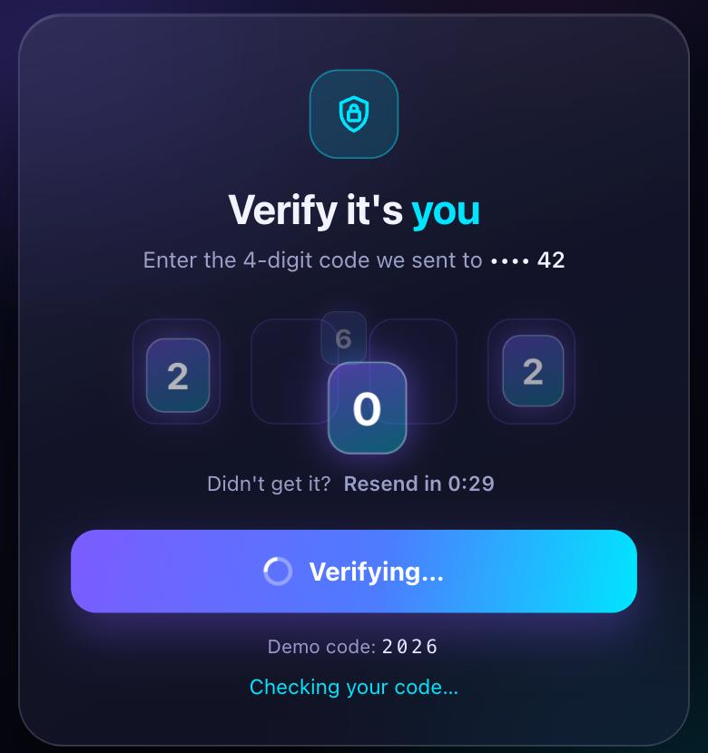

# Glassy OTP Verification

A glassmorphism one-time-code input where the digits lift out of their boxes, circle a tilted 3D orbit and spiral into a spinner that resolves to a check.



**[Live demo](https://arslanagayev.github.io/otp-verify-animation/)** · **[Reel mode](https://arslanagayev.github.io/otp-verify-animation/?reel)** · UI animation #01 of a weekly series on Instagram [@arslanagayev.dev](https://www.instagram.com/arslanagayev.dev/)

Plain **HTML, CSS and JavaScript**: no frameworks, no build step, no dependencies. Use the demo code **2026** (any other code shows the error state).

## How it works

1. You type the 4-digit code (auto-advance, backspace, arrow keys and paste all work).
2. On **Verify**, each digit lifts out of its box and lands on a flat, tilted orbit.
3. The digits circle the orbit **twice**, speeding up and spiralling into the centre. Digits passing the front grow and brighten, digits at the back shrink and dim, so it reads as 3D depth.
4. A gradient ring spins while the code is checked, then turns into a **green check** with a burst of sparks, or a **red cross**, a card shake and a "Not verified" title for a wrong code. Start typing again and the card resets.

## Features

- Keyboard-first: auto-advance, backspace to the previous box, arrow keys, paste the whole code, Enter to submit
- `autocomplete="one-time-code"` so phones can autofill SMS codes
- Resend countdown, success and error states, `aria-live` status messages
- `prefers-reduced-motion` skips the orbit and goes straight to the result

## The key code

```js
// Each digit spirals inward on a tilted orbit
for (let i = 0; i <= steps; i++) {
  const t = smoothstep(i / steps);
  const angle = start - t * turns * Math.PI * 2;
  const r = 1 - t;                  // collapse to the centre
  const depth = Math.sin(angle);    // front = +1, back = -1
  frames.push({
    transform: `translate(${Math.cos(angle) * rx * r}px, ${depth * ry * r}px)
                scale(${0.82 + 0.22 * depth})`,
    opacity: 0.65 + 0.35 * depth,
  });
}
chip.animate(frames, { duration: 1400 });
```

## Use it in your project

Copy `index.html`, `style.css` and `script.js`. The component itself has no dependencies; the `reel/` folder is only used by the reel mode described below. To drop it, delete the `mountReel(...)` call at the end of `script.js` and its import on the first line.

## Reel mode

Add `?reel` to the URL and the page becomes a self-playing 1080×1920 video stage: a title, the animation driven by a scripted cursor, a code excerpt and an end card, on a loop. Open it on a phone and use the built-in screen recorder to get an Instagram reel. `?autoplay` loops the scripted demo without the frame.

The scripted run tries a wrong code first ("Not verified"), then the right one ("Verified"). Options:

- `?reel&ratio=4x5`: a 1080×1350 stage for Instagram carousel videos
- `?reel&nocode`: hide the code excerpt
- `?reel&delay=3000`: wait 3 seconds before the first run (time to start the recorder)

## Run locally

ES modules don't load from `file://`, so serve the folder:

```bash
git clone https://github.com/arslanagayev/otp-verify-animation.git
cd otp-verify-animation
python3 -m http.server 8080   # then open http://localhost:8080
```

## License

[MIT](LICENSE) © 2026 Arslan Agayev
